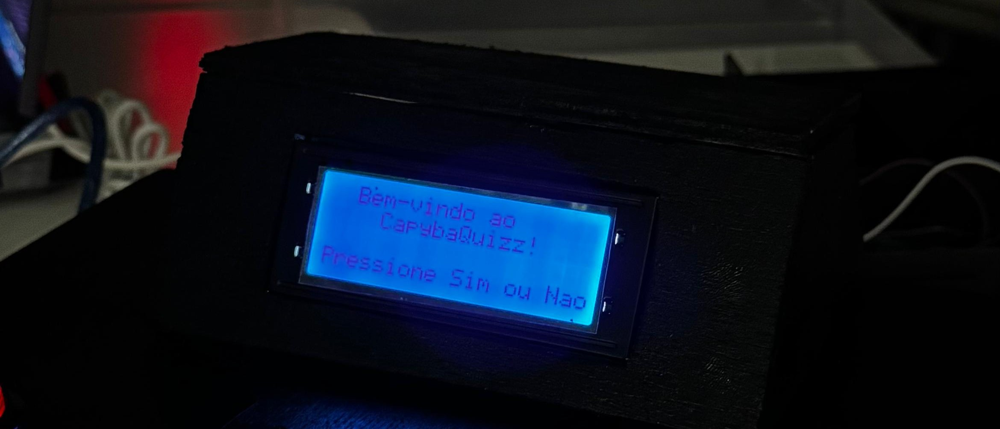
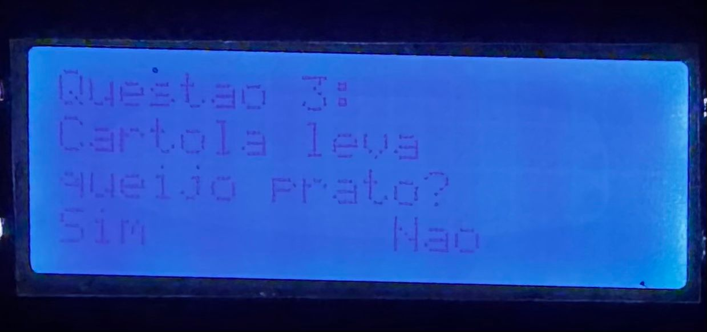

# Capyba Quizz

O Capyba Quizz é um jogo de perguntas e respostas que visa promover a cultura local e facilitar a interação social entre os participantes. Esse formato de jogo incentivará a colaboração e a comunicação, permitindo que os jogadores compartilhem experiências, conhecimentos e histórias por meio das perguntas. Por exemplo, os participantes poderão discutir tradições, receitas e eventos históricos da região, criando um espaço de aprendizado mútuo e troca de saberes.

## Como funciona?

# Tela Inicial
A tela inicial do jogo diz "Bem-vindo ao CapybaQuizz" e pede para apertar o botão de "Sim' ou "Nao"

# Pergunta
Depois de apertar um dos botões para iniciar o jogo, o usuário vai ser levado a uma série de perguntas, respondendo elas com "Sim" ou "Nao"

## Integrantes

| Nome | Turma | Email institucional|
|------|-------|------------|
|Alan Mendes| B | amm3@cesar.school|
|Artur Queiroz| A | amq2@cesar.school|
|Eduardo Albuquerque| A | eaab@cesar.school|
|Gabriela Cruz| B | gmc2@cesar.school|
|Lucas Alves| B| lspa@cesar.school|
|Marselhe Lima| B | nmls@cesar.school|
|Pedro Guerra| A | plgg@cesar.school|
|Rafael Costa| B | rlc3@cesar.school|
